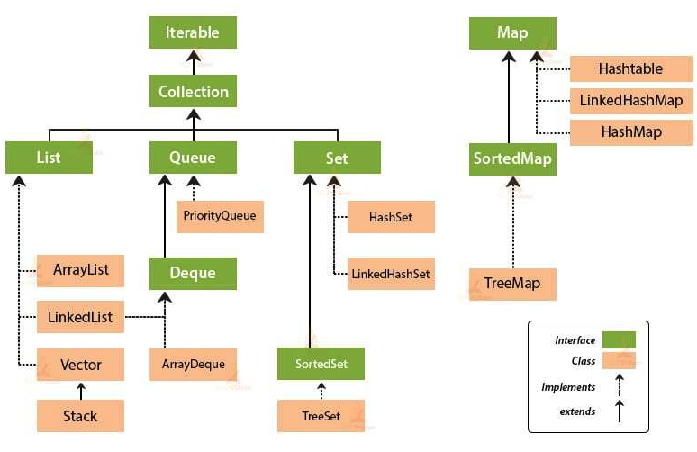

### 컬렉션 프레임워크
 자료구조 종류들의 형태를 자바 클래스로 구현한 모음

> Collection Interface
1. 컬렉션 프레임워크에서 가장 기본이 되는 interface로 자료가 있다는것을 표현함
2. 중복 허용, 자료 저장 순서 없음
3. Method와 반환
 - add(Object) : boolean
 - size() : int
 - iterator() : iterator (저장된 자료를 하나씩 하나씩 꺼냄)
4. Collection은 Iterator를 반환한다.
5. Iterator 제공 Method
  - hasNext() : boolean (자료가 있는지 확인)
  - next() : Object (자료를 꺼냄)

<br>

> Set <Interface>
1. Collection 인터페이스를 상속받는다.
2. 순서가 없고 중복을 허용하지 않음
3. Method와 반환
 - add(Object) : boolean (같은자료가 있으면 false, 없으면 true 반환) 
4. 종류 : HashSet, TreeSet

#### HashSet 예시
```Java
public static void main(String[] args) {
    
    //제너릭을 사용한 String 타입 지정
    //인터페이스이기 때문에 Set이 인스턴스가 될 수 없음
    Set<String> set = new HashSet<>();
    boolean flag1 = set.add("Hello");
    boolean flag2 = set.add("World");
    boolean flag3 = set.add("Hello");

    System.out.println(set.size()); //3개를 저장했지만 중복을 허용하지 않기 때문에 2가 출력됨
    System.out.println(flag1); //true
    System.out.println(flag2); //true
    System.out.println(flag3); //false

    Iterator<String> iter = set.iterator();
    while(iter.hasNext()){
        String str = iter.next();
        System.out.println(str);
    }
}
```

<br>

> List <Interface>
1. Collection 인터페이스를 상속받는다.
2. 중복을 허용, 순서를 기억 (n번째 자료를 가져올 수 있음)
3. Method와 반환
  - get(int) : Object (n번째 자료를 가져옴)

예시
```Java
public static void main(String[] args) {
    List<String> list = new ArrayList<>();
    list.add("Hello");
    list.add("World");
    list.add("Hello");
    System.out.println(list.size()); // 3

    for(int i = 0; i < list.size(); i++){
        String str = list.get(i);
        System.out.println(str); // list에 저장된 중복된 3개 값 모두 출력
    }
}
```

<br>

> Map 
1. Key와 Value를 가지는 자료구조
2. Key들은 중복된 값을 가질 수 없음
2. Method와 반환
  - get(Object) : Object (원하는 값을 꺼낼 때 key를 매개변수로 사용)
  - keySet() : Set (모든 Key들에 대한 정보를 조회하여 Set을 반환)
  - put(Object, Object) : void (key와 value로 값을 저장)
  
<br>

```Java
public static void main(String[] args) {
    Map<String, String> map = new HashMap<>(); //key, value 모두 String 타입인 HashMap 인스턴스 생성
    map.put("001", "Hello");
    map.put("002", "World");
    map.put("003", "!");
    map.put("001", "Hello World!");

    System.out.println(map.size());           // 키가 중복된 값을 제외하고 출력됨 - 3
    System.out.println(map.get("001"));       // 마지막으로 put된 값으로 설정됨 - Hello World!

    Set<String> keys = map.keySet();          // key값을 Set 자료구조에 저장
    Iterator<String> iter = keys.iterator();  //iterator를 통해 Set 자료구조에 있는 key를 꺼냄
    while(iter.hasNext()){
        String key = iter.next();
        String value = map.get(key);
        System.out.println(key + " : " + value);
    }
}
```

<br>

### 컬렉션 프레임워크 구조
