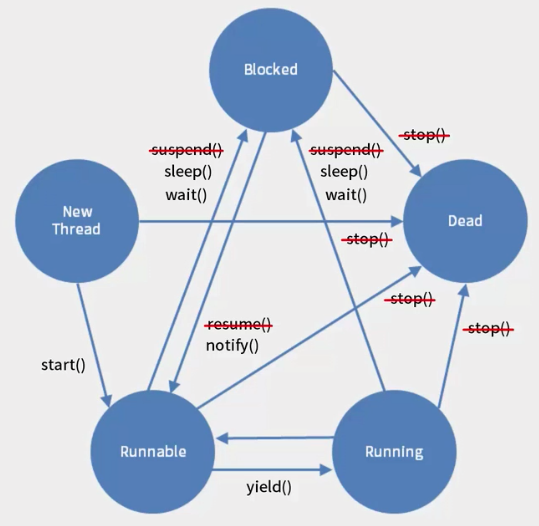

### Thread 만들기

#### 1. Thread 클래스 상속받는 방법
- java.lang.Thread 클래스를 상속 받는다.
- Thread가 가지고 있는 run() 메소드를 오버라이딩한다.

```Java
public class MyThread extends Thread {
    String str;
    public MyThread(String str){
        this.str = str;
    }

    @Override
    public void run() {
        for(int i = 0; i < 10; i++){
            System.out.println(str);
            try {
                Thread.sleep((int)Math.random()*1000);
            } catch (InterruptedException e) {
                e.printStackTrace();
            }
        }
    }
}
```

<br>

```Java
public class ThreadExam {
    public static void main(String[] args) {
        MyThread myThread = new MyThread("hello");
        MyThread myThread2 = new MyThread("hi");

        myThread.start();
        myThread2.start();

        System.out.println("main end");
    }
}
```

<br>

#### 2. Runnable 인터페이스를 구현하는 방법
- Runnable 인터페이스가 가지고 있는 run() 메소드를 구현한다.

```Java
public class MyThread implements Runnable {
    String str;
    public MyThread(String str){
        this.str = str;
    }

    @Override
    public void run() {
        for(int i = 0; i < 10; i++){
            System.out.println(str);
            try {
                Thread.sleep((int)Math.random()*1000);
            } catch (InterruptedException e) {
                e.printStackTrace();
            }
        }
    }
}
```

- 위 MyThread는 Thread를 상속받지 않았기 때문에 Thread가 아니다.
- Thread를 생성하고 생성자에 MyThread를 넣어 Thread를 생성한다.
- Thread 클래스가 가진 start() 메소드를 호출한다.

```Java
public class ThreadExam {
    public static void main(String[] args) {
        MyThread myThread = new MyThread("hello");
        MyThread myThread2 = new MyThread("hi");

        Thread thread1 = new Thread(myThread);
        Thread thread2 = new Thread(myThread2);

        thread1.start();
        thread2.start();
    }
}
```

<br><br>

#### 하나의 객체를 여러개의 Thread가 사용
```Java
public class MusicBox {
    public void playMusicA(){
        for(int i = 0; i < 10; i++){
            System.out.println("신나는음악A");
            try {
                Thread.sleep((int)Math.random() * 1000);
            } catch (InterruptedException e) {
                e.printStackTrace();
            }
        }
    }

    public void playMusicB(){
        for(int i = 0; i < 10; i++){
            System.out.println("신나는음악BB");
            try {
                Thread.sleep((int)Math.random() * 1000);
            } catch (InterruptedException e) {
                e.printStackTrace();
            }
        }
    }

    public void playMusicC(){
        for(int i = 0; i < 10; i++){
            System.out.println("신나는음악CCC");
            try {
                Thread.sleep((int)Math.random() * 1000);
            } catch (InterruptedException e) {
                e.printStackTrace();
            }
        }
    }
}
```

<br>

```Java
public class MusicPlayer extends Thread {
    int type;
    MusicBox musicBox;

    public MusicPlayer(int type, MusicBox musicBox){
        this.type = type;
        this.musicBox = musicBox;
    }

    @Override
    public void run() {
        switch (type){
            case 1:
                musicBox.playMusicA();
                break;
            case 2:
                musicBox.playMusicB();
                break;
            case 3:
                musicBox.playMusicC();
                break;
            default:
        }
    }
}
```

<br>

```Java
public class MusicBoxExam1 {
    public static void main(String[] args) {
        MusicBox box = new MusicBox();

        MusicPlayer kang = new MusicPlayer(1, box);
        MusicPlayer kim = new MusicPlayer(2, box);
        MusicPlayer lee = new MusicPlayer(3, box);

        kang.start();
        kim.start();
        lee.start();
    }
}
```

<br>

#### synchronized
- 공유객체가 메소드를 동시에 호출되지 않게 하기 위해 synchronized를 사용한다.
- 여러개의 Thread들이 메소드를 사용할때 메소드에 synchronized가 있는 경우 먼저 호출한 메소드가 객체 사용권을 갖는다.(Monitoring Lock)
- 메소드 하나가 모두 실행된 후 다른 메소드가 실행됨 (다른 쓰레드들은 대기)

```Java
public synchronized void playMusicA(){
    for(int i = 0; i < 10; i++){
        System.out.println("신나는음악A");
        try {
            Thread.sleep((int)Math.random() * 1000);
        } catch (InterruptedException e) {
            e.printStackTrace();
        }
    }
}
```

<br>

#### 상태제어



- 실행가능상태 : Runnable, Running
- 블록상태 : Thread.sleep() 또는 Object가 가지고 있는 wait() 호출
- Thread.sleep()은 설정 시간이 지나면 스스로 블록상태에서 빠져나와 Runnable 또는 Running 상태가 됨
- wait() 메소드는 다른 쓰레드가 notify()나 notifyAll() 메소드를 호출하기 전에는 블록상태에서 해제되지 않는다.
- wait()메소드는 호출이 되면 모니터링 락을 놓게 된다. 그래서 대기중인 다른 메소드가 실행한다.
- 쓰레드의 run 메소드가 종료되면, 쓰레드는 종료된다. 즉 Dead상태가 된다.
- Thread의 yeild 메소드가 호출되면 해당 쓰레드는 다른 쓰레드에게 자원을 양보하게 된다.
- join 메소드 : 해당 쓰레드가 종료될 때까지 대기

<br>

#### join 메소드

```Java
public class JoinExam { 
    public static void main(String[] args) {
        MyThread thread = new MyThread();
        
        thread.start(); 
        System.out.println("Thread 시작");
        try {
            // 해당 쓰레드가 끝날때까지 대기
            thread.join();
        } catch (InterruptedException e) {
            e.printStackTrace();
        }
        System.out.println("Thread가 종료"); 
    }   
}
```
실행결과 <br>
Thread 시작 <br>
MyThread1 <br>
MyThread2 <br>
MyThread3 <br>
Thread 종료 <br>

<br>

#### wait, notify 메소드

```Java
 public class ThreadB extends Thread{
    int total;
    @Override
    public void run(){
        // 4. synchronized로 모니터링락 획득
        synchronized(this){
            // 5. 반복문 수행
            for(int i=0; i<5 ; i++){
                System.out.println(i + "를 더합니다.");
                total += i;
                try {
                    Thread.sleep(500);
                } catch (InterruptedException e) {
                    e.printStackTrace();
                }
            }
            // 6. notify() 메소드를 호출하여 wait하고 있는 쓰레드를 깨움 
            notify();
        }
    }
}
```

```Java
public class ThreadA {
    public static void main(String[] args){
        ThreadB b = new ThreadB();
        b.start();

        // b에 대하여 동기화 블럭을 설정
        synchronized(b){
            try{
                // 1. 아래 구문 실행됨
                // 2. b.wait()메소드를 호출되어 쓰레드 정지
                // 3. ThreadB 클래스 실행 
                System.out.println("b가 완료될때까지 기다립니다.");
                b.wait();
            }catch(InterruptedException e){
                e.printStackTrace();
            }
            // 7. notify를 호출하게 되면 wait에서 깨어남
            System.out.println("Total is: " + b.total);
        }
    }
}
```

<br>

#### 데몬쓰레드
- 쓰레드에 데몬 설정
- 백그라운드에서 특별한 작업을 처리하게 하는 용도로 사용
- 데몬쓰레드는 일반 쓰레드(main 등)가 모두 종료되면 강제적으로 종료됨

```Java
public class DaemonThread implements Runnable {
    @Override
    public void run() {
        while(true){
            System.out.println("데몬쓰레드가 실행중입니다.");

            try {
                Thread.sleep(500);
            } catch (InterruptedException e) {
                e.printStackTrace();
                break;
            }
        }
    }

    public static void main(String[] args) throws InterruptedException {
        Thread thread = new Thread(new DaemonThread());
        thread.setDaemon(true);
        thread.start();

        Thread.sleep(1000);
        System.out.println("메인쓰레드가 종료됩니다.");
    }
}
```